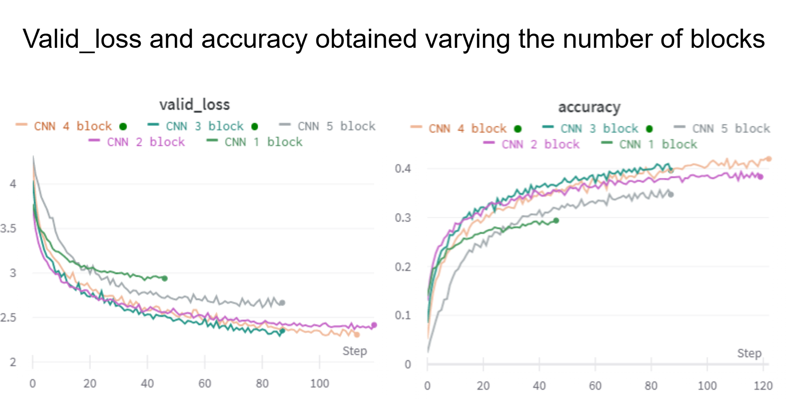

# Classification CIFAR-100

## Classification on the CIFAR100 library.

## Dataset
The **CIFAR100 dataset** consists of:
This dataset has 100 classes containing 600 images each. There are 500 training images and 100 testing images per class. The 100 classes in the CIFAR-100 are grouped into 20 superclasses. Each image comes with a "fine" label (the class to which it belongs) and a "coarse" label (the superclass to which it belongs).

https://www.cs.toronto.edu/~kriz/cifar.html

## Project Goals
1. **Preprocessing**:
   - Augment the dataset to improve model generalization (e.g., rotation, flipping, cropping).

2. **Feature Extraction**:
   - Extract meaningful features from images using mainly:
     - Deep learning-based methods (e.g., CNNs).

3. **Classification**:
   - Train a machine learning model to classify plankton species.
   - Experiment with models such as:
     - Convolutional Neural Networks (CNNs).
     - Pre-trained models (e.g., ResNet, VGG16) with transfer learning.

4. **Evaluation**:
   - Evaluate model performance using metrics like accuracy, precision, recall, and F1-score.
  
5. **Results**
   

