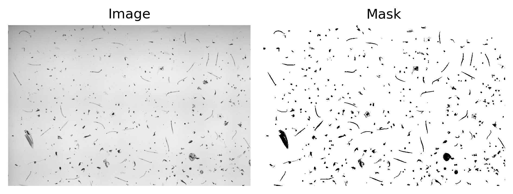
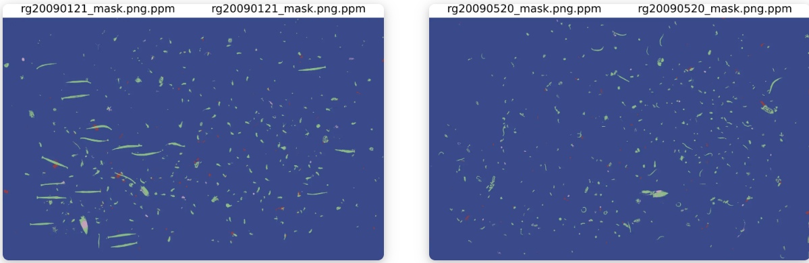

# Plankton Classification

## Project Overview
This project focuses on applying **computer vision techniques** to classify plankton species using the **Plankton dataset**. The dataset contains high-resolution images of plankton samples, which are essential for studying marine biodiversity and ecosystem health. The goal is to build a robust machine learning model that can automatically classify plankton species from the images.

  
*Figure 1: Example of a plankton image from the dataset.*

---

## Dataset
The **Plankton dataset** consists of:
- High-resolution grayscale images of plankton samples and masks.
- Metadata for each image, including species labels.
- A diverse set of plankton species, including copepods, diatoms, and other micro-organisms.

We have 21 fully labeled samples for training, and 3 scans are going to be used for validation. The annotations have been provided by :
Sorbonne Université/CNRS - Institut de la Mer de Villefranche (IMEV), Sorbonne Université/CNRS - Laboratoire d'Océanographie de Villefranche (LOV); 2020; Plankton community in Régent (680µm) net, Point B, Villefranche-sur-Mer, France https://dx.doi.org/10.14284/477

## Project Goals
1. **Preprocessing**:
   - Extract patches from the images that have large resolutions.
   - Augment the dataset to improve model generalization (e.g., rotation, flipping, cropping).

2. **Feature Extraction**:
   - Extract meaningful features from plankton images using mainly:
     - Deep learning-based methods (e.g., CNNs).

3. **Classification**:
   - Train a machine learning model to classify plankton species.
   - Experiment with models such as:
     - Convolutional Neural Networks (CNNs).
     - Pre-trained models (e.g., ResNet, UNet) with transfer learning.

4. **Evaluation**:
   - Evaluate model performance using metrics like accuracy, precision, recall, and F1-score.
  
## Results
  
*Figure 1: Results with F1 = 0.90061.*

